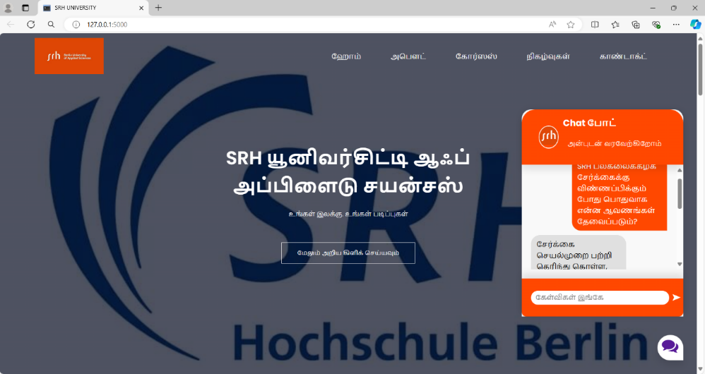

# SRH University Website

## Project Overview
The SRH University Website is a responsive, multi-page web application designed to showcase the university's offerings, including courses, events, and contact information. The project includes dynamic content, interactive features, and a clean, professional design to provide an engaging user experience.

## Features

### 1. Multi-Page Navigation
- **Pages:**
  - Home
  - About Us
  - Courses
  - Events
  - Contact Us
- Localization in Tamil for user accessibility.

### 2. Dynamic Content
- Developed using Python's Flask framework.
- URL routing for seamless navigation between pages.

### 3. Interactive Features
- Embedded chatbot for user queries.
- Google Maps integration for displaying campus locations.
- Information on webinars and career guidance sessions.

### 4. Responsive Design
- Mobile-first approach using CSS Flexbox and Grid.
- Ensures optimal viewing on all devices, including desktops, tablets, and smartphones.

### 5. Styling and Assets
- **CSS Styling:**
  - Custom `style.css` for unified design.
  - Linear gradient backgrounds and hover effects for modern aesthetics.
- **Assets:**
  - FontAwesome for icons.
  - Google Fonts for typography.

## Code Highlights

### HTML Structure
- Modular templates using `base.html` for consistent headers and footers.
- Tamil text localization for region-specific audiences.

### CSS Customization
- Unified styling in a single `style.css` file.
- Responsive elements and hover effects for enhanced user experience.

### JavaScript Interactivity
- Custom scripts for toggle menus and chatbot functionality.

## Setup Instructions

### Prerequisites
- Python 3.x installed on your machine.
- Flask framework installed. Run:
  ```bash
  pip install flask
  ```
## Screenshots

### Homepage


### Chatbot 
![Chatbot] (Screenshots/Picture1.png)


### Installation Steps
1. Clone the repository:
   ```bash
   git clone https://github.com/your-username/srh-university-website.git
   ```
2. Navigate to the project directory:
   ```bash
   cd srh-university-website
   ```
3. Install the required dependencies:
   ```bash
   pip install -r requirements.txt
   ```
4. Run the development server:
   ```bash
   flask run
   ```
5. Open the website in your browser at `http://127.0.0.1:5000`.

## File Structure
```
project-folder/
├── static/
│   ├── images/
│   ├── style.css
│
├── templates/
│   ├── base.html
│   ├── index.html
│   ├── about.html
│   ├── courses.html
│   ├── events.html
│   ├── contact.html
│
├── app.py
├── requirements.txt
```


## Contributions
Contributions are welcome! Please fork the repository and submit a pull request.

## License
This project is licensed under the MIT License - see the LICENSE file for details.

## Contact
For any questions or feedback, feel free to reach out via email or open an issue on GitHub.
